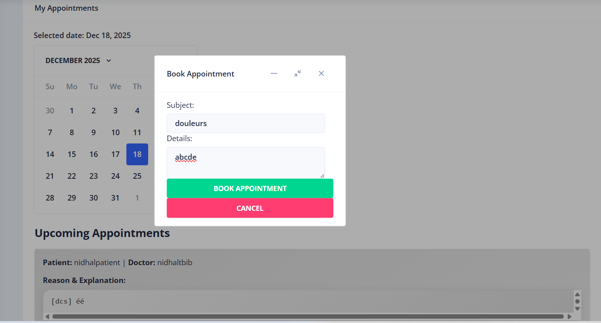
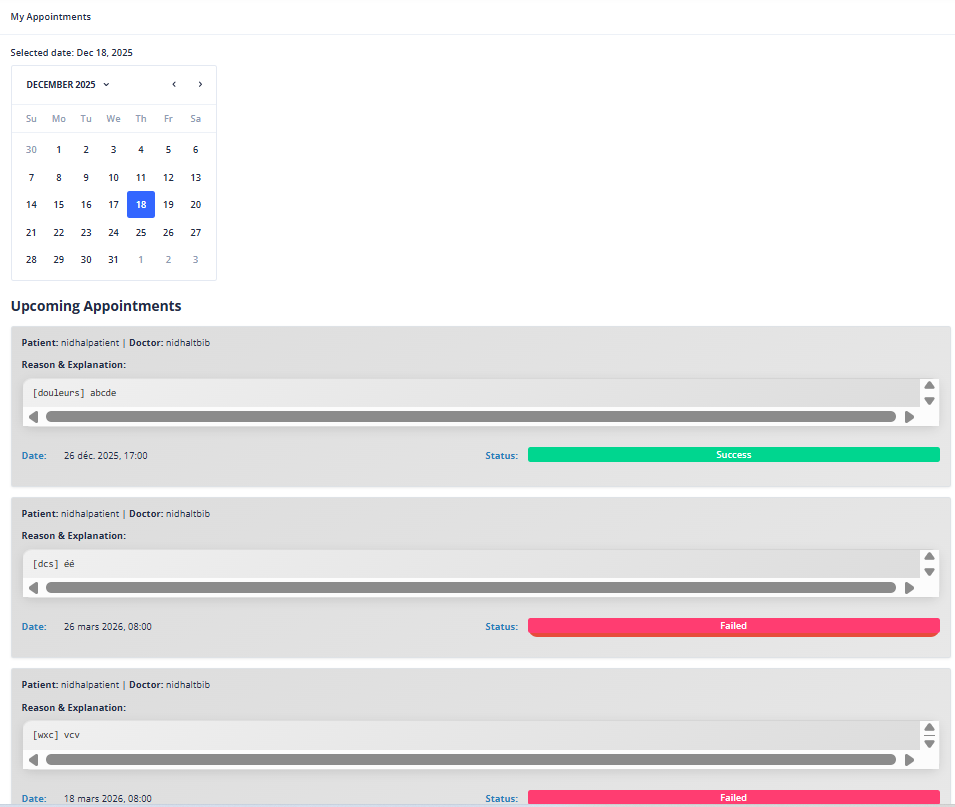
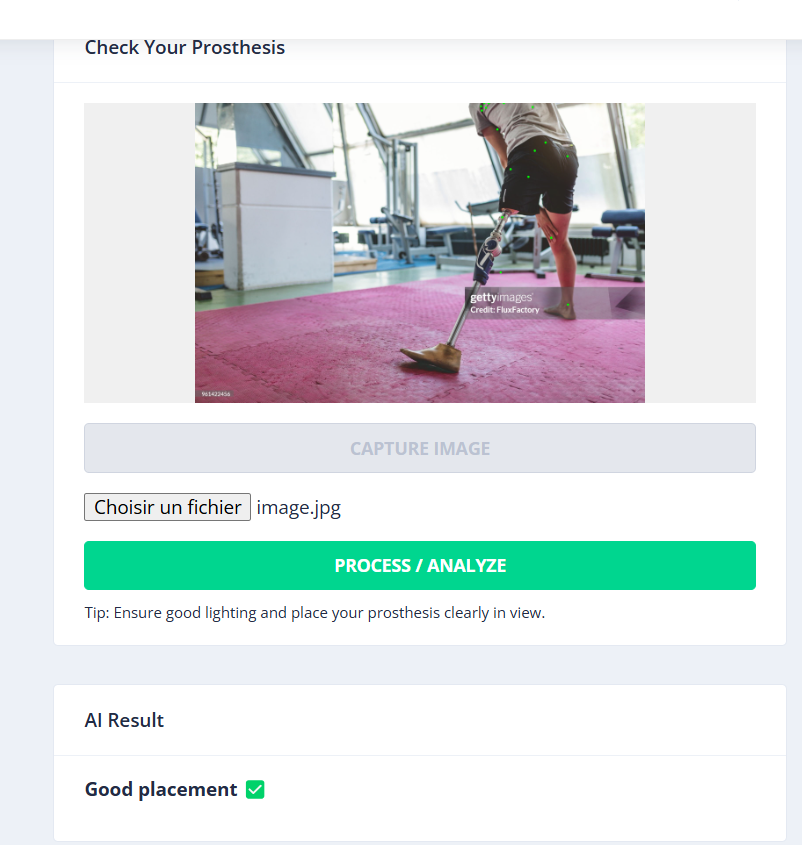
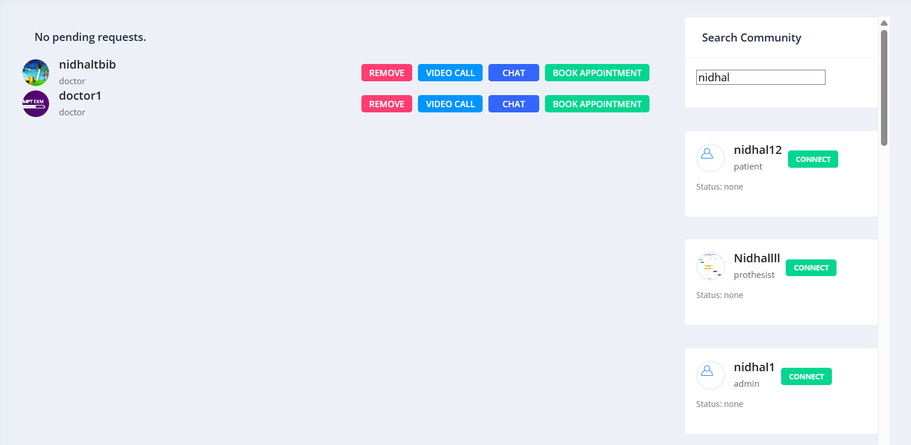
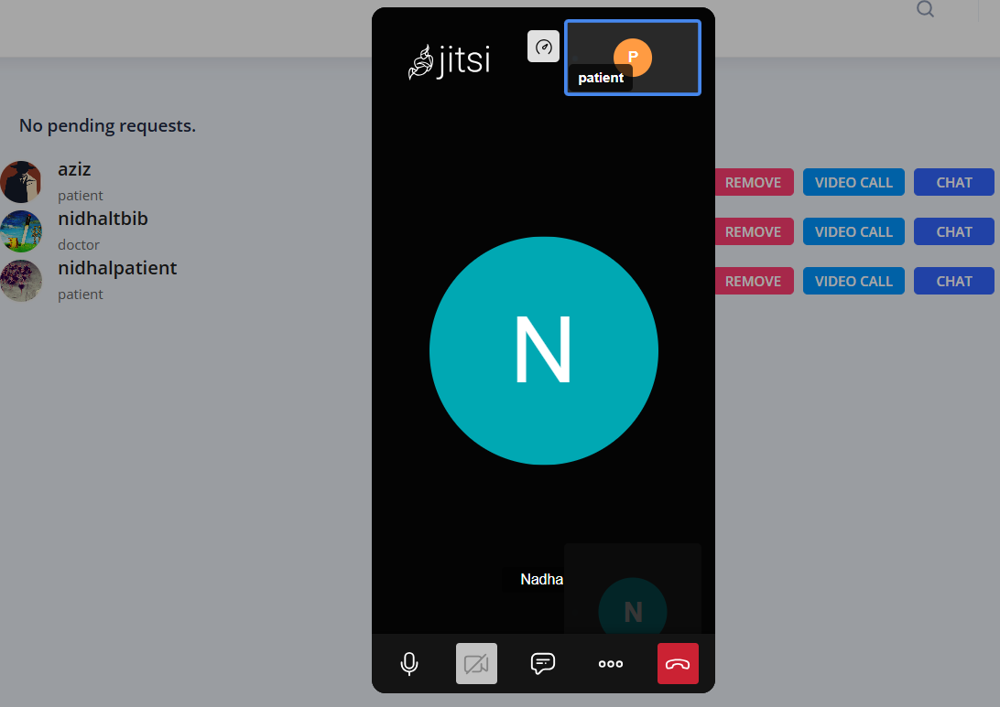

# 🏥 Medico — AI-Powered Medical Web Platform

Medico is a full-stack healthcare platform designed to bring together **medical data management, clinical workflows, real-time communication, and AI-assisted medical image analysis** in a single web application.

The platform combines an Angular frontend with a Django REST backend and integrates a YOLO-based computer vision pipeline to assist with medical image analysis.

## ✨ Overview

Medico was developed as an end-to-end software engineering project, covering frontend development, backend API design, authentication, real-time communication, database management, and AI integration.

The platform provides different capabilities for managing healthcare-related workflows while allowing users to communicate and interact with medical information through a centralized interface.

### Key capabilities

* 🤖 AI-assisted medical image analysis using YOLO and deep learning
* 🔐 Secure authentication and user profile management
* 💬 Real-time communication using WebSockets
* 📅 Appointment and healthcare workflow management
* 📊 Medical data management through dedicated dashboards
* 📹 Real-time video communication
* 👥 Community and user interaction features
* 🏗️ Modular full-stack architecture

---

## 🏗️ Architecture

Medico follows a separated frontend/backend architecture:

```text
                    ┌──────────────────────┐
                    │      Angular UI      │
                    │   TypeScript / HTML  │
                    └──────────┬───────────┘
                               │
                         REST / WebSockets
                               │
                    ┌──────────▼───────────┐
                    │   Django Backend     │
                    │ Django REST Framework│
                    └───────┬───────┬──────┘
                            │       │
                    ┌───────▼───┐ ┌─▼─────────────┐
                    │ Database  │ │ AI Processing │
                    │           │ │ YOLO / CV     │
                    └───────────┘ └───────────────┘
```

The architecture separates presentation, API/business logic, data management, and AI processing responsibilities, allowing each layer to evolve independently.

---

## 🤖 AI & Computer Vision

One of the core components of Medico is its AI-assisted medical image analysis functionality.

The platform integrates a **YOLO-based computer vision model** to process medical images and provide analysis results through the application.

### AI pipeline

```text
Medical Image
      │
      ▼
Image Upload
      │
      ▼
Backend Processing
      │
      ▼
YOLO / Deep Learning Model
      │
      ▼
Detection / Analysis Results
      │
      ▼
Results displayed in Angular
```

The AI component is integrated directly into the application workflow rather than being treated as a standalone model.

---

## 💬 Real-Time Communication

Medico uses **WebSockets** to support real-time communication between connected users.

This enables functionality such as:

* Real-time messaging
* Live communication
* Instant updates
* Video communication workflows

The use of WebSockets allows the application to move beyond traditional request/response interactions for features requiring immediate updates.

---

## 🔐 Authentication & Security

The platform includes authentication and user profile management to control access to healthcare-related functionality.

Sensitive configuration values are kept outside the source code through environment variables and excluded from version control.

> ⚠️ Medico is an academic/software engineering project and is **not intended for use as a production medical system**.

---

## 🛠️ Technology Stack

### Backend

* Python
* Django
* Django REST Framework
* WebSockets

### Frontend

* Angular
* TypeScript
* HTML
* CSS

### AI / Computer Vision

* YOLO
* Deep Learning
* Computer Vision

### Development

* Git
* REST APIs
* Environment-based configuration

---

## 📂 Project Structure

```text
Medico/
│
├── medico backend/
│   └── Django backend
│
├── Medico Project/
│   └── Angular frontend
│
└── assets/
    └── screenshots/
```

---

## 📸 Application Screenshots

### 📅 Appointment Management



### 🤖 AI Analysis



### 🩺 Medical Check



### 👥 Community



### 📹 Video Communication



---

## 🚀 Getting Started

### Backend

```bash
# Create a virtual environment
python -m venv venv

# Activate the environment

# Windows
venv\Scripts\activate

# Linux / macOS
source venv/bin/activate

# Install dependencies
pip install -r requirements.txt

# Start the Django server
python manage.py runserver
```

### Frontend

```bash
# Install dependencies
npm install

# Start the Angular development server
ng serve
```

The exact setup may require additional environment-specific configuration depending on the services enabled in the project.

---

## 🔐 Environment Variables

Sensitive configuration is managed through environment variables rather than being committed directly to the repository.

Before running the application, configure the required environment variables for the backend and any external services used by the project.

---

## 🎯 Engineering Focus

This project provided hands-on experience with:

* Full-stack application architecture
* REST API development
* Angular frontend development
* Backend development with Django
* Real-time communication
* AI model integration
* Computer vision
* Authentication
* Database-driven applications
* Git-based development

---

## 👨‍💻 Author

### Nidhal Dalhoumi

**Software Engineer | Backend • Full-Stack • AI**

* GitHub: [NidhalDal](https://github.com/Nidhaldal)
* LinkedIn: [Nidhal Dalhoumi](https://www.linkedin.com/in/nidhal-dalhoumi-1b4a721a6/)
* Portfolio: [nidhaldal.github.io](https://nidhaldal.github.io/)
